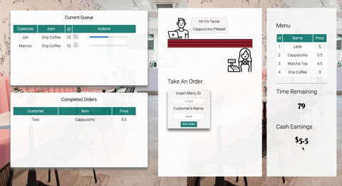

# ROASTVILLE: Handlebars Project READ ME
        
## Summary

A game for those of us who have always wanted to work in a cafe. For 90 seconds you are challenged to work register and barista. In the register, you take orders from customers based on their request. Careful when you type: You need the item code not name! 

As a barista, you can only work on two orders at a time but it is up to you to decide which orders to work on. You can delete orders if it was accidentally created. Once an order is being made, you can't delete it. 

Lots of fun and a great way to make some money!

## Site Picture



## Table of Contents

- [Technologies Used](#Technologies-Used)
- [Learning Points](#Learning-Points)
- [Use](#Use)
- [Installation](#Installation)
- [Code Snippets](#Code-Snippets)
- [Usage](#Usage)
- [Acknowledgements](#Acknoledgements)
- [Author](#Author)

## Technologies Used
- mysql - used to store and retrieve data
- Javascript / Node / Handlebars - used to build an interactive and dynamic game
- HTML and CSS - used to create a good looking game
- Git - version control system for tracking changes to code
- Github - to host the repository
- Heroku - to host the deployed site

## Learning Points
- How to use handlebars to create templates to update one field in an application so as to not rely on location.reload()
- Building a full stack application is fun and exciting. By building a game, rather than just a simple list to add, modify, and delete items I was able to see how the full stack works together.
- There is a difference between what is in the database and what you show your users. In the case of the game, I wanted to keep tracking old orders without showing these to new users.

## Dependencies
```
express
express-handlebars
mysql
router
```
## Installation
The game can be played through the deployed site. To make changes:

- You will need to download this folder into your computer either by cloning the git repository or downloading the files are a zip.
- Once the files are accessible in tour local computer, navigate inside the employee tracker folder and do an install of the following packages by using: 
```
npm install mysql
npm install express-handlebars
npm install express
npm install router
```

- navigate to the config folder and change the connection to your mysql database and update the user and password information.

- copy the files under db (schema and seed) and create the right database and starter data.

- Once you have successfully installed those packages and setup mysql, you can run the program by typing the following command to your terminal
```
node app.js
```

## Usage
- There is seed data for orders and menu items. The game only utilizes the menu items. You can update these to whatever name and value you want; however on the client side, server there is a list that needs to be updated as well.

## Code Snippet
This was a rewarding challenge so there are a few things I would like to highlight but I am most proud of this API call. In order to create a new record and automatically show the data on the page without a page reload, I modified the create API call to actually make two requests to the database. 

The first request creates the data record and the second requests all data related to that record (including data from a join) and renders an HTML block of information that was templatized from the cafe partials template.

On the client side, the response is appended to the page. 

```
router.post("/api/orders", function (req, res) {
    order.create([
        "item_id", "customer_name", "delivered"
    ], [req.body.item_id, req.body.customer_name, false
    ], function (result) {
        var condition = `id = ${result.insertId}`;
        order.one(condition, function (data) {

            res.render("partials/cafe/cafe-block", {
                layout: false,
                id: data[0].id,
                item: data[0].item,
                customer_name: data[0].customer_name,
                delivered: data[0].delivered,
                price: data[0].price,
                time: data[0].time
            });

        });
    });
});
```

## Acknowledgements
In order to make a beautiful game, I needed cool icons. I used the Noun Project and found these images:
- by monkik: Cashier, Cycling, listening to music, working
- by Made: cafe


## Author
[GitHub](https://github.com/analoo)

